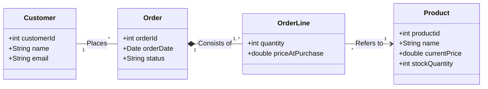

```mermaid

classDiagram
    direction LR

class Customer {
    +int customerId
    +String name
    +String email
}
class Order{
    +int orderId
    +Date orderDate
    +String status
}

class OrderLine{
    +int quantity
    +double priceAtPurchase

}

class Product {
    +int productid
    +String name
    +double currentPrice
    +int stockQuantity
}
  %% Relationships with precise UML arrows and multiplicit
    Customer "1" -- "*" Order : Places
    Order "1" *-- "1..*" OrderLine : Consists of
    OrderLine "*" --> "1" Product : Refers to

```