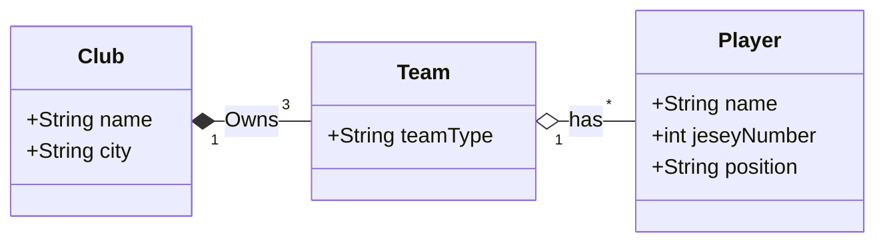

```mermaid
classDiagram
direction LR

class Club{
    +String name
    +String city
}

class Team {
    +String teamType
}

class Player{
    +String name
    +int jeseyNumber
    +String position
}

%% Relationships with precise UML arrows and multiplicity
Club "1" *-- "3" Team : Owns
    Team "1" o-- "*" Player : has
```