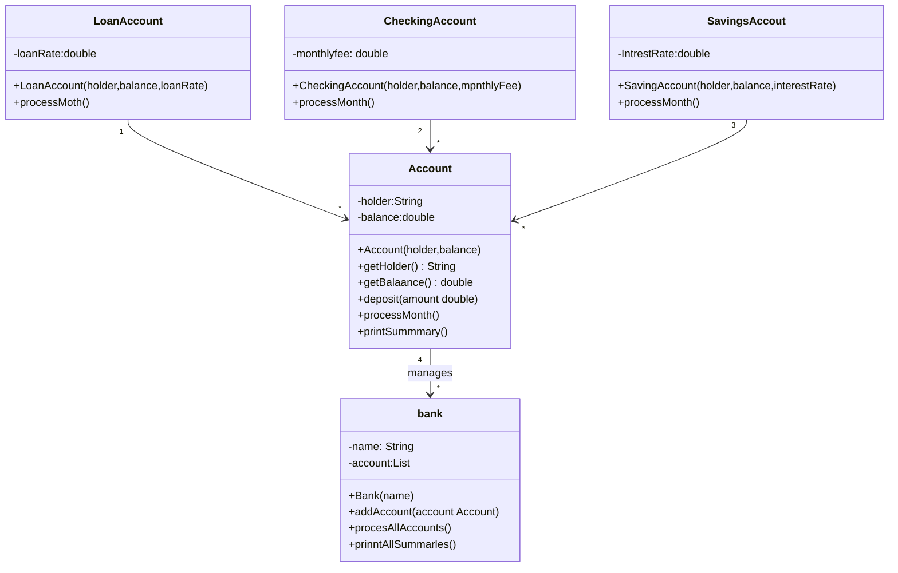

```mermaid
classDiagram
    direction TB

    class bank{
        -name: String 
        -account:List<Account>
        +Bank(name)    
        +addAccount(account Account)
        +procesAllAccounts()
        +prinntAllSummarles()

    }
    class Account{
        -holder:String
        -balance:double
        +Account(holder,balance)
        +getHolder()String
        +getBalaance()double
        +deposit(amount double)
        +processMonth()
        +printSummmary()
   
    }
    class SavingsAccout{
        -IntrestRate:double
        +SavingAccount(holder,balance,interestRate)
        +processMonth()
    }
    class CheckingAccount{
    -monthlyfee: double
    +CheckingAccount(holder,balance,mpnthlyFee)
    +processMonth()
    }
    class LoanAccount{
        -loanRate:double
        +LoanAccount(holder,balance,loanRate)
        +processMoth()
    }
    LoanAccount "1" -->"*"Account
    CheckingAccount "2"-->"*"Account
    SavingsAccout "3"-->"*"Account
    Account "4"-->"*"bank : manages
    
    
    

```    